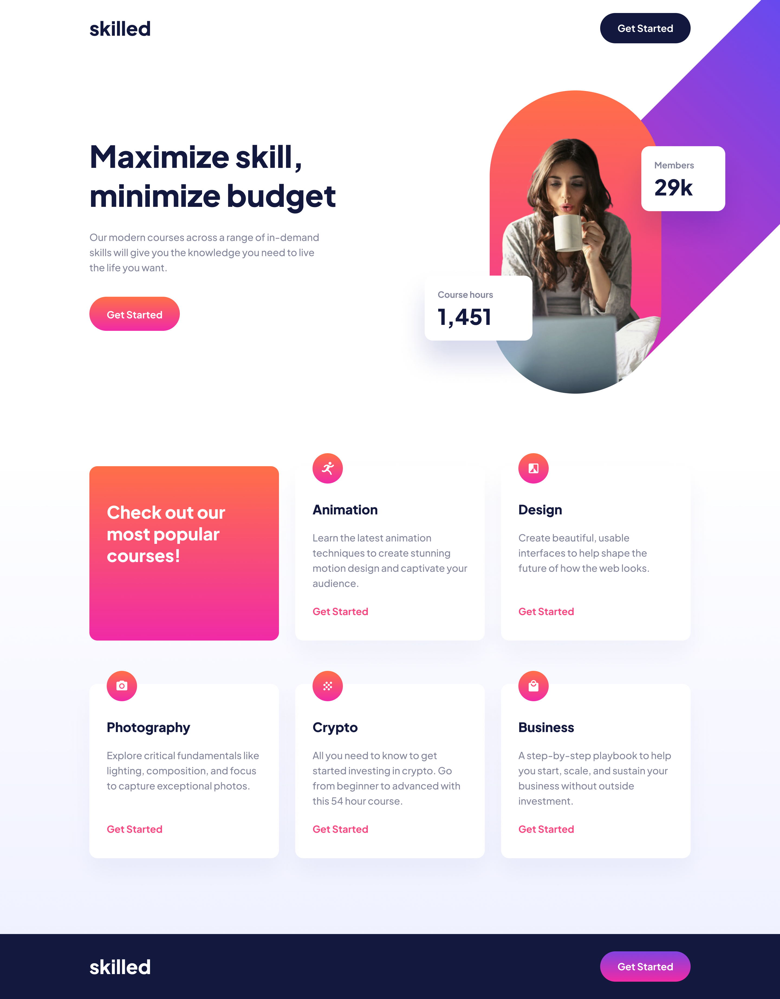

# skill-learning-landing-fem

This is a solution to the [Skilled e-learning landing page challenge on Frontend Mentor](https://www.frontendmentor.io/challenges/skilled-elearning-landing-page-S1ObDrZ8q). Frontend Mentor challenges help you improve your coding skills by building realistic projects.

## Table of contents

- [skill-learning-landing-fem](#skill-learning-landing-fem)
  - [Table of contents](#table-of-contents)
  - [Overview](#overview)
    - [The challenge](#the-challenge)
    - [Screenshot](#screenshot)
    - [Links](#links)
  - [My process](#my-process)
    - [Built with](#built-with)
    - [What I learned](#what-i-learned)

## Overview

### The challenge

Users should be able to:

- View the optimal layout depending on their device's screen size
- See hover states for interactive elements

### Screenshot

### Links

- Solution URL: [Live soluation](https://your-solution-url.com)
- Live Site URL: [live Website ](https://itsnooshin.github.io/skill-learning-landing-fem/)

## My process

### Built with

- Semantic HTML5 markup
- CSS custom properties
- Flexbox
- CSS Grid
- Mobile-first workflow

### What I learned

I learned how to add multiple images for different devices, and the most difficult part was making it responsive, especially for tablets and desktops. Thanks to the MDN and Slack communities, I found out how to fix that by using position relative and absolute.

